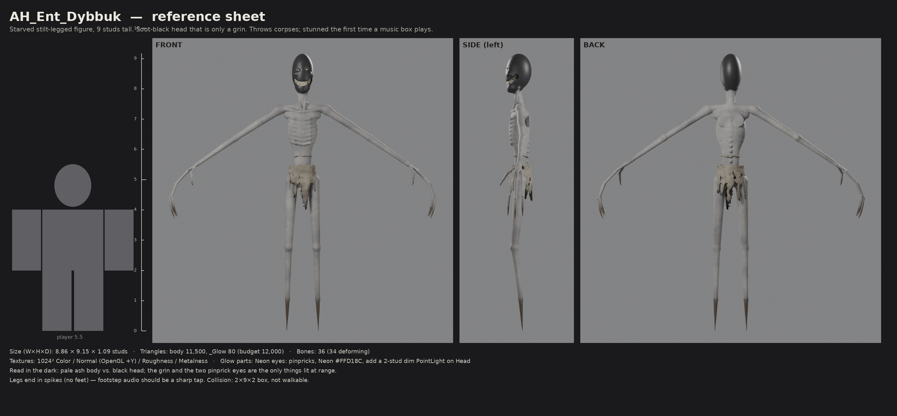
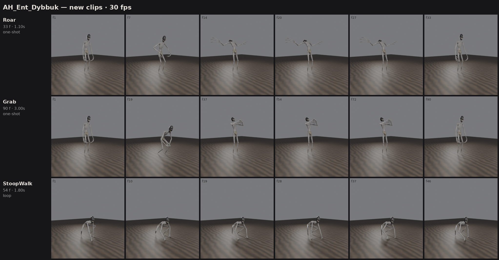
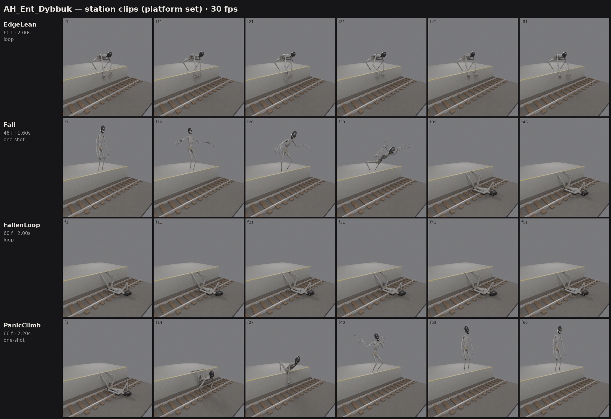
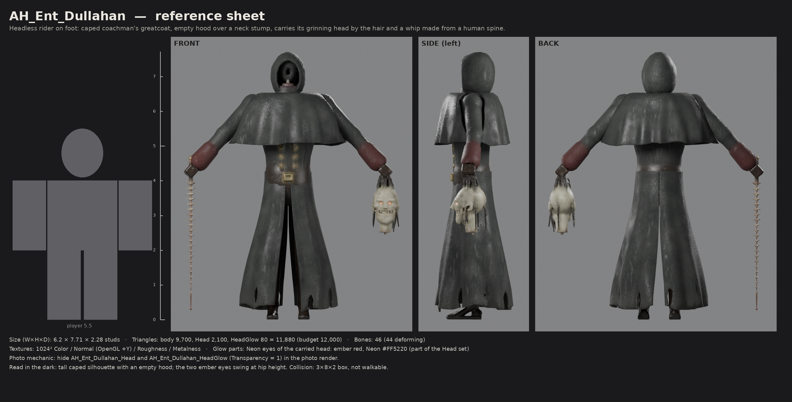
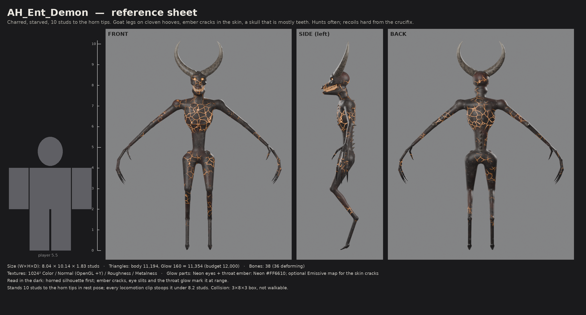
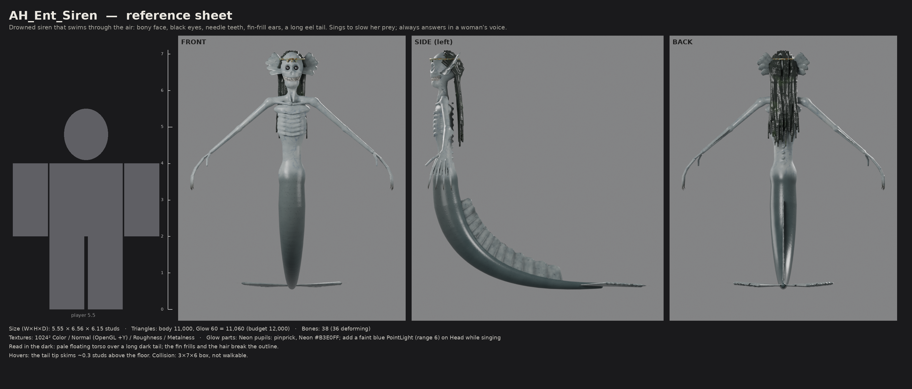
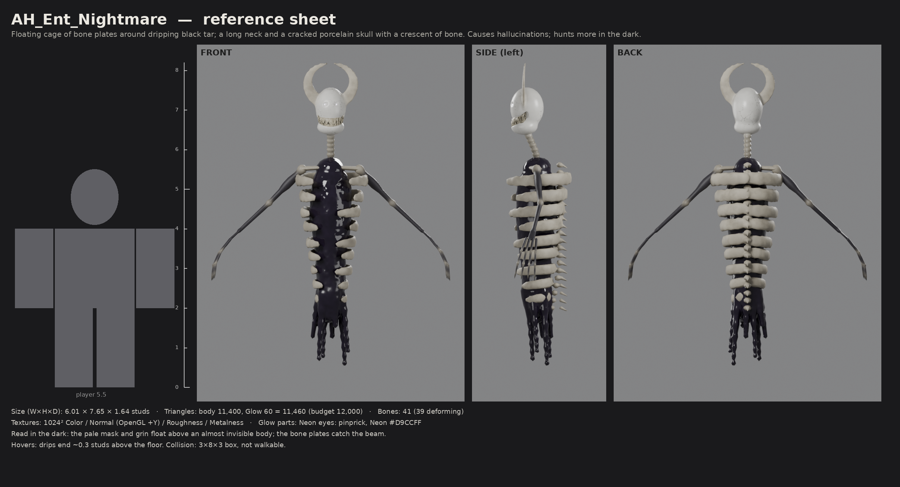

# Ashgrove House — Entity Pack 1

Five entities for *Ashgrove House*, built to the **Art & Model Brief** (Oct 4, 2026):
**Dybbuk, Dullahan, Demon, Siren, Nightmare**. Banshee and Aswang come next, in Pack 2.

Each entity comes with:

| Brief asked for | Where it is |
|---|---|
| Concept description + reference sheet (front / side / back) | this README + `Entities/<Name>/Review/AH_Ent_<Name>_RefSheet.png` |
| Model as FBX in studs | `Entities/<Name>/AH_Ent_<Name>.fbx` (rig + skinned meshes) |
| PBR textures (colour, normal, roughness, metalness) | `Entities/<Name>/Textures/` — 1024², normal map OpenGL (+Y) |
| Rigged model + animations as separate FBX clips | `Entities/<Name>/Animations/AH_Ent_<Name>_Anim_<Clip>.fbx` (30 fps, in place; each clip includes the skinned meshes and bind pose) |
| One-line note of anything changed and why | "Changes from the brief" at the end of each entity below |

Also included:

- **In-game light check:** `Review/AH_Ent_<Name>_InGameLight.png` shows the entity lit only by a flashlight, and silhouetted by lightning.
- **Animation sheet:** `Review/AH_Ent_<Name>_AnimSheet.png` shows six frames of every clip.
- **Sources:** `Source/AH_Ent_<Name>.blend` (Blender 5.0) and `Source/stats.json` (sizes, triangle counts, bone and influence checks).
- **Procedural pipeline:** `tools/` rebuilds everything (see the end of this README).

## Specs check (all five)

| Entity | Size W×H×D (studs) | Triangles (≤ 12,000) | Bones (≤ ~50) | Max influences | Clips |
|---|---|---|---|---|---|
| Dybbuk | 8.9 × 9.2 × 1.1 (A-pose) | 11,580 | 36 | 4 | 16 |
| Dullahan | 6.2 × 7.7 × 2.3 | 11,880 (body 9,700 + head 2,100 + eyes 80) | 46 | 4 | 8 |
| Demon | 8.0 × 10.1 × 1.8 (to horn tips) | 11,354 | 38 | 4 | 8 |
| Siren | 5.6 × 7.1 × 6.2 (long tail; floats 0.5 up) | 11,060 | 38 | 4 | 8 |
| Nightmare | 6.0 × 8.2 × 1.6 (floats 0.5 up) | 11,460 | 41 | 4 | 7 |

Sizes are taken from the bind pose. The width of the bipeds is their A-pose arm span.

- **Export settings:** Forward −Z, Up Y, Apply Unit, FBX Units Scale (scale 1.0, no ×100), no leaf bones, armature exported as a Null.
- **Scale:** 1 Blender unit = 1 stud. The file is marked as metres with node scale 1, so **import at scale 1**: no 0.01 factor.
- **Transforms:** the axis conversion is baked into the mesh and bone data. The rig node, both mesh nodes and the `Root` bone are identity in every file; the rig node shows about 0.000004° of float rounding. `Root` carries no rotation keys in any clip.
- **Hierarchy:** every mesh is a child of the rig node, so the importer attaches it to the root.
- **Clips:** every clip FBX carries the skinned meshes and their bind pose (all bones, `Root` and `HumanoidRootNode` included), so the importer can store motion relative to rest.
- **Facing:** origin at the base centre between the feet, Y up.
- **Rig:** `Root` at the feet → `HumanoidRootNode` at the hips → `Hips` → …
  - Neither `Root` nor `HumanoidRootNode` deforms.
  - The hips bone is named `HumanoidRootNode` (Roblox's own skinned-rig name), so it can't collide with the `HumanoidRootPart` part Roblox creates.
  - Skinned with at most 4 influences per vertex and no unweighted vertices.
- **Materials:** PBR for `SurfaceAppearance`. No lighting is baked into the colour maps. Small glow parts (eyes, the Demon's throat) are separate meshes meant for **Neon**.

## Importing into Roblox Studio

1. **Model:** use *File → Import 3D* and pick `AH_Ent_<Name>.fbx`.
   - Rig type: *Custom*. Keep *Import Only As Model* on.
   - Import at scale 1. Each entity should come in at the height in the table above.
   - If it imports facing backwards, flip *World Forward*.
2. **Textures:** upload the four PNGs from `Textures/`. Then add a `SurfaceAppearance` to each textured MeshPart: `ColorMap` = `_Color`, `NormalMap` = `_Normal`, `RoughnessMap` = `_Roughness`, `MetalnessMap` = `_Metalness`.
   - The Dullahan's body and carried head share one texture set.
   - The Demon also ships `_Emissive.png` (an ember-crack mask). If your SurfaceAppearance supports an emissive mask, plug it in with an orange tint; otherwise the cracks already read as bright orange in the colour map.
3. **Glow meshes** (`*_Glow`, `*_HeadGlow`): set `Material = Neon` and the colour from the entity section below. These parts take no SurfaceAppearance.
4. **Animations:** select the imported rig and open *Animation Editor → ⋯ → Import → From File / From FBX Animation*. Pick a clip from `Animations/`, then publish it. Play clips through an `AnimationController` + `Animator` (or a Humanoid's Animator). Clips are in place: your movement code moves the root.

### How the files are checked

These checks run outside Roblox Studio:

- `tools/inspect_fbx.py <file.fbx>` reads each file directly. It prints the unit scale, every node's parent and transform, the bind poses, and the `Root` / `HumanoidRootNode` rotation keys.
- `tools/verify_anim.py <Name>` re-imports every clip and compares each joint's world position with the source animation. All 40 clips match within 0.0003 studs.

### Export history

**Re-export of Oct 4, 2026.** This followed the first Studio import, and fixed three problems:

- Clips imported rotated (rig node −90°, `Root` keyed 90°).
- Models imported 100× too large.
- The body mesh got a Motor6D joined to itself.

**Clip re-export, same day.** Clips had been exported as the armature alone, with no bind pose, and Roblox applied the rest pose twice. Each clip FBX now includes the skinned meshes, so it carries the bind pose.

The meshes, UVs, textures and animation are unchanged. `tools/reexport.py` re-exports from the `.blend` sources.

---

## Dybbuk — `AH_Ent_Dybbuk`



**Concept.** In Ashkenazi Jewish folklore a dybbuk is a dislocated, malicious soul that cannot move on and clings to the living. This is the thing from the opened box in the cellar vault: a starved, too-tall ash-grey figure, about 9 studs. It stands on stilt legs that end in spikes instead of feet. Its arms reach its knees, with three long fingers and hooked black nails. Torn grave linen hangs at the hips. The head is soot-black and featureless apart from a grin of crooked, missing teeth and two pinprick eyes deep in narrow sockets. In the dark, the pale body against the black head reads first. At range, only the grin and the eyes catch light. There are no religious symbols anywhere.

**Glow:** eyes, Neon `#FFD18C`. Optionally add a dim PointLight (range 2) on the Head bone.

| Clip | Frames | Notes |
|---|---|---|
| Idle | 120 loop | Breathing; two sharp head twitches; fingers flex |
| Walk | 48 loop | Stiff stilt gait |
| Run | 24 loop | Bent double, arms reaching (hunt) |
| Attack | 45 | Hands close on frame 24 |
| ThrowCorpse | 75 | Grips on frame 25, **releases on frame 55**. Attach the corpse to `Hand_R` / `Hand_L` |
| Stunned | 75 | Music box: recoil, clutch head, freeze. Then loop… |
| StunnedLoop | 30 loop | …for as long as the stun lasts |
| Manifest | 60 | Unfolds from a heap on the floor |
| Vanish | 36 | Arches, collapses down through the floor line |

**Added clips (Pack 1.1).** Seven more clips on the same rig. The model and the nine clips above are unchanged.




| Clip | Frames | Notes |
|---|---|---|
| Roar | 33 | Crouches in, then throws its head back, arms flung out, jaw wide. Peak on frame 13; plays after the head turn |
| Grab | 90 | Lunges low and **clamps a player on frame 19**, hoists them to its face (frame 39), holds them up shaking, then **flings them down on frame 79**. Weld the player to the midpoint of `Hand_L` and `Hand_R` between those frames |
| StoopWalk | 54 loop | Low passages: torso level, spike legs splayed, knuckles to the floor, head held upright. Top of head about 4.6 rig studs (6.4 at ×1.4) |
| EdgeLean | 60 loop | Crouched at the platform edge, folded over the drop, raking both hands down at the track bed and screaming |
| Fall | 48 | When stunned at the edge: jolts, sways and topples forward. It lands **face down on the track bed on frame 37**, its spike legs still hooked over the platform edge |
| FallenLoop | 60 loop | Lies twitching on the rails. Play after Fall for as long as the stun lasts |
| PanicClimb | 66 | Jerks awake, shoves itself up, scrambles back over the edge and snaps upright. It ends in the normal stand pose, so Idle, Walk or Run can follow |

**Station clips.** EdgeLean, Fall, FallenLoop and PanicClimb carry their own root motion (on `HumanoidRootNode`). Keep the model's pivot where the Dybbuk stands on the platform, with its feet 0.8 rig studs behind the edge, for the whole sequence: Fall → FallenLoop → PanicClimb. The body drops onto the track bed and climbs back by itself. Two things to handle in code:

- Collision and hit boxes don't follow the root motion. While it's down, move or extend them toward the track bed in code.
- They assume a platform 3.0 rig studs high (4.2 studs at ×1.4) and an edge 0.8 rig studs (1.1 at ×1.4) in front of the feet. These are `PLATFORM_H` and `EDGE` at the top of the animation section in `tools/build_dybbuk.py`. To match a different platform, set them and run `python3 add_clips.py Dybbuk EdgeLean Fall FallenLoop PanicClimb` (about a minute).

**Changes from the brief.** Bipeds were modelled in A-pose for clean skinning (the reference sheet shows that pose). The spike legs make footsteps a "tap"; the brief had no foot spec, so I chose the scarier option.

## Dullahan — `AH_Ent_Dullahan`



**Concept.** The Irish headless rider, on foot in the portrait gallery. It is a tall figure, about 7.7 studs, in a soaked, tattered black coachman's greatcoat:
- a caped shoulder cape
- a double row of tarnished brass buttons, oxblood cuffs
- a belt, and tall riding boots

The hood stands up stiff around nothing: inside is a short, dark neck stump with a little exposed spine. Its left hand carries its own head by the hair. The head is mould-pale ("the colour and texture of mouldy cheese"), with a grin from ear to ear and two small ember eyes. Its right hand holds the folklore whip made from a human spine: about 20 vertebrae, a leather grip and a brass pommel. Gore is limited to what the folklore needs, as the brief said: the stump, the torn neck of the head, and the whip.

**Photo mechanic ("appears headless in photos").** The carried head is its own mesh: `AH_Ent_Dullahan_Head` plus `AH_Ent_Dullahan_HeadGlow`. Hide both while the photo renders and the Dullahan is completely headless.

**Glow:** head eyes, Neon `#FF5220`.

| Clip | Frames | Notes |
|---|---|---|
| Idle | 120 loop | Still; the head turns in its hand and the jaw twitches; whip lies on the floor |
| Walk | 42 loop | Slow stalk. Coat panels follow the legs; the head swings; the whip drags |
| Stride | 30 loop | Faster. Use as it keeps seeing its target… |
| Run | 22 loop | …then this: coat flaring, whip trailing (brief: "moves faster the longer it sees you") |
| AttackWhip | 48 | Whip raised overhead, **cracks forward around frame 24** |
| Reveal | 60 | Kill / jumpscare: lifts the head to the player's face (frame ~26); the jaw drops in a laugh |
| Manifest | 60 | Rises from one knee |
| Vanish | 36 | Turns away; coat swirls; sinks |

The whip, coat panels, shoulder cape and carried head are driven by follow-through bones (`Whip1-8`, `Coat*`, `Cape*`, `HeadProp`, `HeadJaw`). They are already animated in every clip.

**Changes from the brief.** No horse: the gallery is indoors, so it walks; the horse can come later. The hood is empty in normal view and the head is always carried. The brief had no horse spec, and an empty hood reads scarier in the dark.

## Demon — `AH_Ent_Demon`



**Concept.** A demon in the broad European sense, pushed toward burnt and starved:
- skin charred black with ash flakes and a raw red undertone, split by ember cracks that glow on the chest, throat and joints
- goat legs on cloven hooves, broad bony shoulders over a waist you could close a hand around, a ridge of small spines down the back
- long arms with three taloned fingers
- an elongated goat-like skull that is mostly teeth, with burning eye slits, an ember glow down the throat, and ribbed horns sweeping up into a crescent

There are no religious symbols: the crucifix is the player's item, not the Demon's.

**Glow:** eye slits and throat, Neon `#FF6610`. There is also an optional `_Emissive` mask for the skin cracks.

| Clip | Frames | Notes |
|---|---|---|
| Idle | 120 loop | Heavy breathing through the teeth; claws flex; a jaw snap |
| Walk | 42 loop | Predatory stalk, stooped |
| Run | 21 loop | Bent low, bounding, claws forward |
| Attack | 39 | Rears up, double claw slash **lands on frame 20** |
| Roar | 60 | Hunt start: arms wide, jaw unhinged, head shaking |
| RepelledCross | 45 | Flinches from the crucifix with an arm over its face and staggers back. Bigger than the other entities' recoils: the brief says crosses are more effective on it |
| Manifest | 60 | Uncurls from a crouched knot |
| Vanish | 36 | Folds down into the floor |

**Changes from the brief.** It stands 10 studs to the horn tips in bind pose. Every locomotion clip stoops it under about 8.2 studs so it fits doorways. I assumed 8-stud doors, since the kit dimensions weren't in the brief.

## Siren — `AH_Ent_Siren`



**Concept.** The singer of Greek myth, given the fish's tail of later European tradition, and drowned:
- waterlogged blue-grey skin over bone, gill slits on the neck
- a skull-like face with deep black eyes and pinprick pale pupils, and a lipless mouth of needle teeth
- spined fin-frills where the ears should be
- webbed hands with long nails, a fin along each forearm
- wet hair clumped down the back
- a long eel tail with a dorsal fin and a ragged horizontal fluke
- a corroded bronze circlet: all that is left of who she was

She swims through the air as if the house were underwater: "seen roaming far away from the ocean".

**Glow:** pupils, Neon `#B3E0FF`. A faint blue PointLight on the Head while singing helps sell the "slows people" moment.

| Clip | Frames | Notes |
|---|---|---|
| Idle | 120 loop | Hovering; tail undulates; hair drifts |
| Swim | 48 loop | Roaming |
| SwimFast | 24 loop | Hunting: arms forward, jaw open |
| Sing | 90 loop | Head lifted, mouth open, arms and frills spread. Loop it while she slows players; pair with the humming audio |
| Attack | 42 | Coils back, lunges, **hands clamp on frame 24** |
| Scream | 45 | Jaw unhinges, frills snap open |
| Manifest | 60 | Surfaces up out of the floor |
| Vanish | 36 | Dives back down |

**Changes from the brief.** She has no legs and never touches the floor; the tail tip skims it. I chose a floating, swimming motion over dragging herself, because it is stranger in a house.

## Nightmare — `AH_Ent_Nightmare`



**Concept.** The Germanic / Scandinavian *mara* (Slavic *mora*): the spirit that sits on a sleeper's chest and gives them bad dreams, and the source of the word "nightmare". Usually harmless; this one has taken form.
- **Body:** a floating cage of curved bone plates around a core of black tar that drips away beneath it.
- **Head:** a long vertebral neck up to a cracked, porcelain-pale skull mask with two crowded rows of teeth in an ear-to-ear grin, and slanted sockets with pinprick eyes.
- **Crescent:** a bone crescent over the brow, the moon it comes with.
- **Arms:** long, thin and black, with four needle fingers.

In the dark, the mask and grin float above an almost invisible body.

**Glow:** eyes, Neon `#D9CCFF`.

| Clip | Frames | Notes |
|---|---|---|
| Idle | 120 loop | Hovering; head tilts with a sudden twitch; drips sway |
| Drift | 60 loop | Roaming glide; drips trail |
| Hunt | 30 loop | Fast glide, arms reaching, head jitters (hunts more in the dark) |
| Attack | 54 | "Rides" the victim: rears up, drops forward, **pins on frame 24** with both hands |
| Hallucinate | 60 loop | Head snaps through impossible angles (90°, 180°); body stutters. Play it during hallucination events |
| Manifest | 60 | Pours up out of the floor |
| Vanish | 36 | Melts back down |

**Changes from the brief.** I gave it arms (the reference only shows the cage) so the folklore "sitting on the chest" attack can be animated.

---

## Rebuilding / editing

Everything here is generated from code, so the art can be iterated quickly:

```bash
pip install bpy numpy scikit-image pillow      # Blender 5.0 as a Python module
cd art/ashgrove/tools
python3 build_dybbuk.py --preview              # ~1 min: sculpt check → Entities/Dybbuk/Review/_preview.png
python3 build_dybbuk.py                        # ~3-4 min: full build (mesh, bake, rig, clips, renders)
python3 build_dybbuk.py --skip-bake --anim-sheet-only   # iterate on animation only
python3 reexport.py Dybbuk                     # re-export FBX from Source/*.blend only (seconds)
python3 add_clips.py Dybbuk Roar Grab          # (re)bake named clips onto the finished rig + review sheet
python3 inspect_fbx.py ../Entities/Dybbuk/AH_Ent_Dybbuk.fbx   # check nodes, scale, Root keys
python3 verify_anim.py Dybbuk                  # round-trip every clip against the source
```

How the pipeline works:

1. **Shapes:** each creature is described as signed-distance primitives (`sdf.py`). Each primitive is tagged with the bone that owns it and a material region.
2. **Meshes:** marching cubes builds a high-poly sculpt, which is decimated to the game mesh. `blendkit.py` then:
   - unwraps it
   - bakes Color / Roughness / Metalness / Normal (and Emissive) from procedural materials
   - skins it from the primitive ownership
   - keys the clips, using IK and follow-through helpers from `motion.py`
   - exports the FBX files, baking the axis conversion into the data (`blendkit.RobloxSpace`) and keeping meshes under the rig node
3. **Renders:** `review.py` renders the review sheets.

The `.blend` in each `Source/` folder is a normal Blender file if you'd rather hand-edit.
