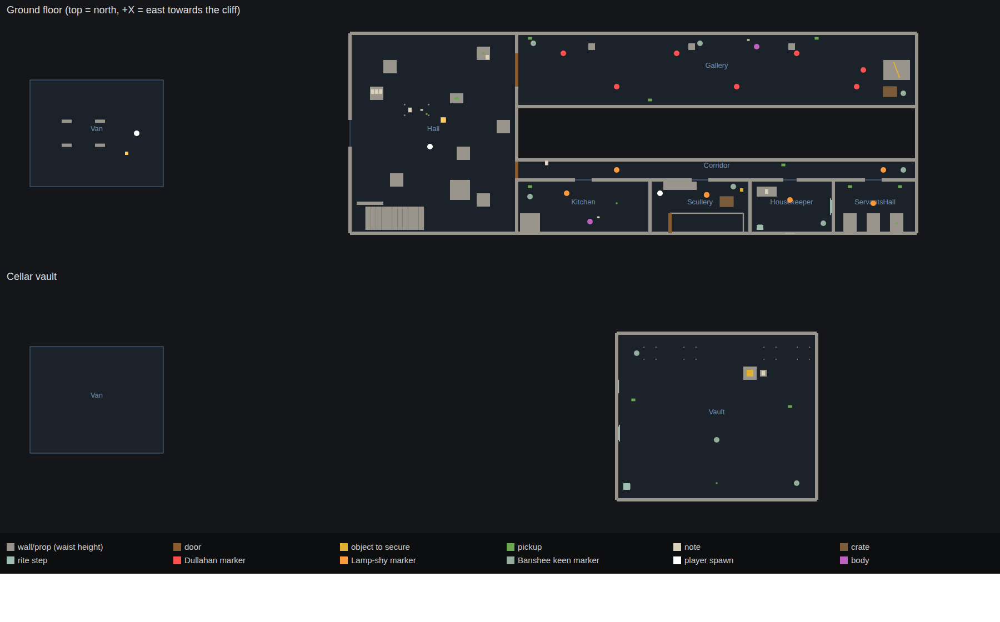

# Ashgrove House: Story 1 greybox

A playable greybox of Story 1, built to [the direction doc](../docs/ASHGROVE_DIRECTION.md). Everything is made of grey blocks and no sound ids are set. The systems are the real ones: the pistol, the Dullahan, the Lamp-shy, the Banshee's keen, retrieval, rites, checkpoints and co-op.

## Install it in Studio

Pick one of three ways.

### 1. Paste one file (easiest)

1. In Roblox Studio, choose **File > New > Baseplate**.
2. Open **View > Command Bar**.
3. Open [`AshgroveInstaller.lua`](AshgroveInstaller.lua), copy **all** of it, paste it into the Command Bar and press **Enter**.
4. Press **Play**.

The installer creates the three script trees below, builds the greybox house in the Workspace and removes the template's Baseplate, whose floor would otherwise fill the cellar. One Ctrl+Z undoes it. Running it again replaces the scripts with the new version and leaves your house edits alone.

If the Command Bar won't take a paste that long, there's a fallback. Paste the file into a new **Script** in ServerStorage, right-click it, choose **Save as Local Plugin…**, then click **Plugins > Ashgrove > Install**.

### 2. Rojo

From this folder, run `rojo serve` and connect the Rojo plugin. Then run `require(game.ServerScriptService.Ashgrove.Greybox).build()` in the Command Bar to see the house before you press Play. Otherwise it builds itself when the game starts.

### 3. By hand

| In Studio | Class | From |
|---|---|---|
| `ReplicatedStorage.Ashgrove` | Folder of ModuleScripts | `src/shared/Ashgrove/*.luau` |
| `ServerScriptService.Ashgrove` | **Script** with `init.server.luau` as its source; every other file is a child ModuleScript; `Entities` is a child Folder | `src/server/Ashgrove/` |
| `StarterPlayer.StarterPlayerScripts.AshgroveClient` | **LocalScript** with `init.client.luau` as its source; the other files are child ModuleScripts | `src/client/AshgroveClient/` |

Each ModuleScript's name is its file name without `.luau`. Delete the Baseplate.

### After installing

- In **Game Settings > Places**, set **Max Players to 4**. Co-op is designed for 1–4 players.
- To test co-op, use **Test > Clients and Servers** with 2–4 players.

## Controls

| Key | Action |
|---|---|
| WASD | move |
| Shift | sprint (loud) |
| C | crouch (silent; also how you approach the Banshee while she mourns) |
| F | torch |
| Click | shoot. Stand still and the ring closes in: the dot is where the shot goes |
| R | reload (3 s, can't be cancelled, and your torch goes off) |
| G | raise the gold sovereign, if you have it |
| E | interact |
| Q | put a note down |
| H | help |
| **Studio only:** F6 / F7 / F8 | skip to the next chapter / force a keen where you stand / refill ammo and battery |

PC keyboard and mouse only for now.

## What happens in Story 1

| Chapter | Beat |
|---|---|
| I. The Second Crew | You start at the van. The hall is the first crew's camp, with the manifest, a voice memo, catalogue cards and the gold sovereign. The hall is a sanctuary. |
| II. The Portrait Gallery | The Dullahan sees only what his carried head faces. Shoot the head out of his hands, then kill him while he's blind. Securing the spine whip takes 4 s, or 7 s while he's up. A distant keen sounds about four minutes in. |
| III. The Servants' Wing | The bell board rings for the room an entity is in. The Lamp-shy freezes in any light. The Banshee mourns over Okafor's body: crouch, keep your torch off her face, and you can play Wren's memo. Then comes the first keen: kill something, get out, or keep the wake custom in the housekeeper's room. Securing the lantern makes the storm cut the hall's power. |
| IV. The Cellar Vault | The sealed box is open and empty. She keens with nothing down there to kill. Keep the vault's custom or get out, then get everyone back to the van. She keeps keening after you've left. |

Every chapter start is a checkpoint. If everyone is down or taken at once, the whole party goes back to the last checkpoint with the ammo they had there.

## Where things are

| System | File | What it does |
|---|---|---|
| Tuning | `src/shared/Ashgrove/Config.luau` | **Every number and every sound id.** Tune here. |
| Story text | `src/shared/Ashgrove/Notes.luau` | Manifest, catalogue cards, voice memos, the housekeeper's book |
| Story order | `src/server/Ashgrove/Director.luau` | Chapters, objectives, checkpoints, story beats, wipes, Studio debug keys |
| The Banshee | `src/server/Ashgrove/Banshee.luau` | Distant, Mourning, Keening and Taking; the three ways to answer a keen |
| Entities | `src/server/Ashgrove/Entities/` | `Entity` (binding, banish, re-form, movement), `Dullahan`, `Lampshy`, `Rigs` (greybox bodies) |
| Players | `src/server/Ashgrove/Crew.luau` | Hits, going down, reviving, being taken, wipes, the torch, the gold ward, committed actions, footstep noise |
| Pistol | `src/server/Ashgrove/Gun.luau`, `src/client/AshgroveClient/Aim.luau` | Server: ammo and hits. Client: sway, crosshair, local torch |
| Objectives | `Retrieval.luau`, `Rites.luau`, `Doors.luau`, `Reading.luau`, `Pickups.luau` | Securing objects, wake rites, story locks and lockouts, notes, ammo and batteries |
| World | `Greybox.luau`, `Map.luau`, `Storm.luau`, `Light.luau`, `BellBoard.luau` | House layout; zone and marker lookup; storm, lightning and power cuts; "is this point lit?"; the bell board |
| Client | `src/client/AshgroveClient/` | `Hud`, `Controls`, `Aim`, `Effects` |

## Replacing the greybox with art

The gameplay never reads the grey blocks. It reads only what's in `AshgroveHouse.Zones`, `.Markers` and `.Interact`, by name and attribute. The header of `Greybox.luau` lists them. So:

- **Rooms and props:** replace anything in `AshgroveHouse.Geometry` freely, using the brief's `AH_Kit_*` and `AH_Prop_*` pieces. Keep the zones covering the rooms and the markers on the floor. Run `tools/check_greybox.luau` (below) after big changes.
- **Interactives:** a note, pickup, object, door, crate or rite step can be any part, as long as it keeps its attributes (`NoteId`, `Kind`, `ObjectId`, `DoorId`, `CrateFor`, `RiteStep` …).
- **Entities:** the contract is at the top of `Entities/Rigs.luau`. Killable entities need a Humanoid, an invisible unrotated `HumanoidRootPart`, and `Hitbox` attributes on hittable parts. The Dullahan's head must be a separate `CarriedHead` part held by a `Weld`. The Banshee needs an invisible `Root` at her feet and a `Face` part.
- **The Banshee's colour** is `Config.banshee.colour`. Nothing else may use it.

## Audio

Every slot in `Config.sounds` is empty and is skipped while it's empty. Every sound that carries information also shows a caption, so the game plays fine silent. Fill in Creator Store ids as `rbxassetid://…`. Short brief:

| Key | Should sound like |
|---|---|
| `keen` | The signature: a woman's wail, rising, not a scream. Loops; nothing else may resemble it |
| `keenDistant` | The same keen, far off through walls, filtered |
| `bansheeTake` | The keen cut off by one sharp breath |
| `rain`, `thunder` | Heavy rain loop; distant and close thunder |
| `dullahanWhip`, `dullahanBreath` | Dry crack that carries; wet breathing from the head, not the body |
| `headDrop` | Heavy, soft thud and roll |
| `lampshyChitter`, `lampshyLunge` | Wet clicking and chewing; a fast skitter |
| `gunshot`, `reload`, `dryFire` | Loud, roomy pistol shot; a slow manual reload; an empty click |
| `bell` | Single servants' bell on a spring |
| `riteStep`, `secure`, `pickup`, `hurt` | Clock stopping or cloth over glass; crate lid and nails; small item; impact grunt |

## Tools

- `python3 tools/build_installer.py` regenerates `AshgroveInstaller.lua` from `src/`. **Run it after every code change**, or the paste file goes stale.
- `lune run tools/check_greybox.luau` builds the house outside Studio and checks markers, zones, walking routes, the stair headroom and the gallery sight line. It needs [Lune](https://lune-org.github.io).
- `rojo build default.project.json -o build/scripts.rbxlx`, then `lune run tools/build_place.luau build/scripts.rbxlx build/Ashgrove.rbxl`, makes a place file with the house already in it.
- `lune run tools/check_installer.luau AshgroveInstaller.lua build/scripts.rbxlx` confirms the paste file builds exactly what Rojo builds.

## Status and limits

- **Not yet played in Studio.** This was written and checked without a Roblox runtime:
  - the Luau type-checks against the Roblox API with no errors;
  - the greybox builds, and passes the geometry check;
  - the installer produces exactly the tree Rojo builds.

  Physics, pathfinding, feel and balance haven't been checked yet. Expect bugs and tuning on the first session.
- **The Lamp-shy is a placeholder** for open decision #1 in the direction doc.
- Greybox rigs have no animations; they slide.
- There's no save data, lobby or matchmaking. One server is one run; rejoin to play again.
- The upper floor is blocked off for later stories.
