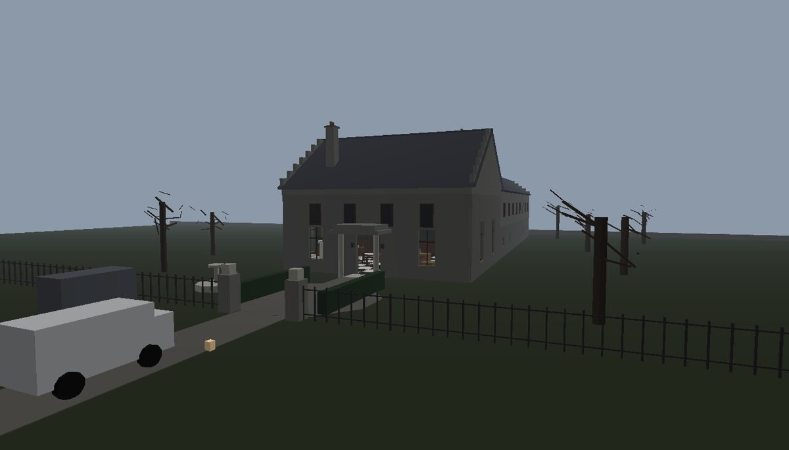
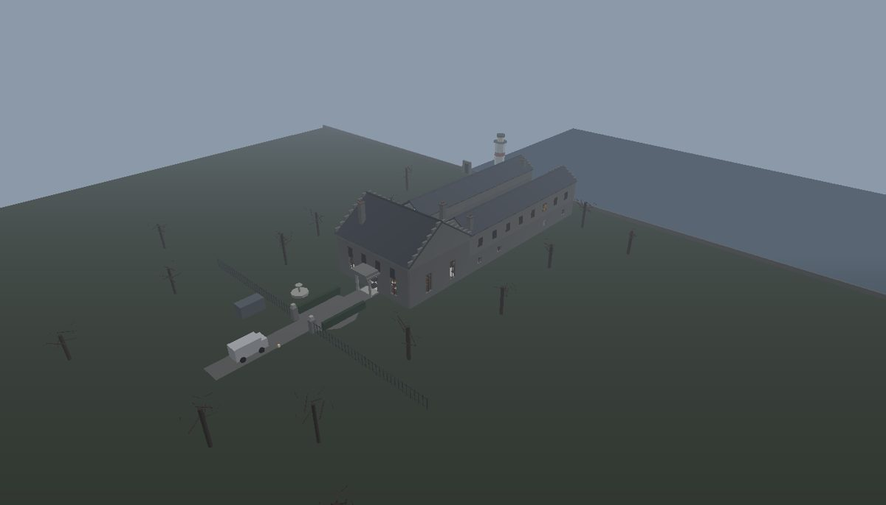
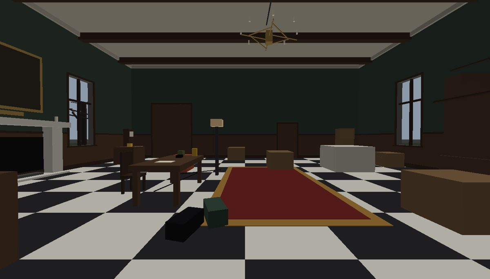
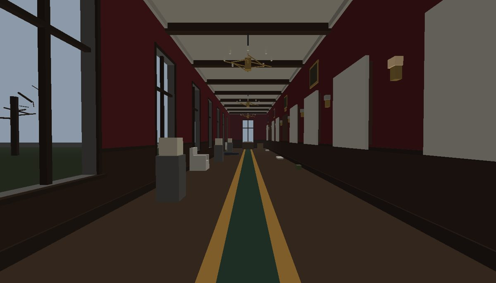
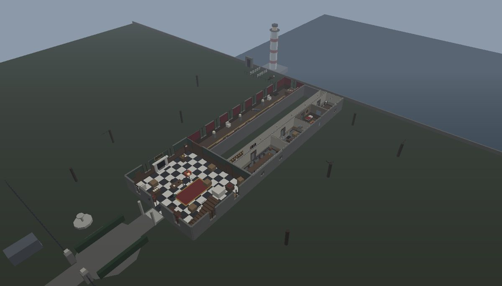
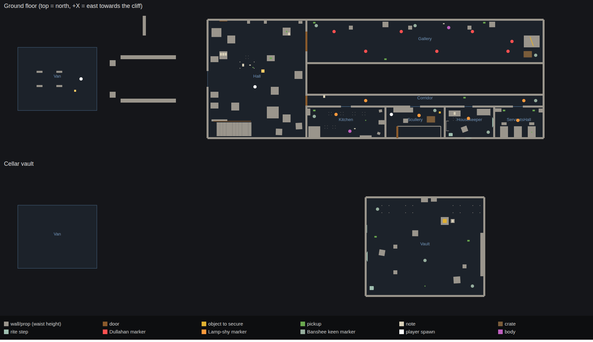

# Ashgrove House

Story 1, playable, on a dressed map of Ashgrove House. It's built to [the creative direction](../docs/ASHGROVE_DIRECTION.md) and [the story](../docs/ASHGROVE_STORY.md), which covers all five stories. It plugs into **your gun and your monster models**: Ashgrove has no gun of its own and uses your models when it finds them.

| | |
|---|---|
|  |  |
|  |  |



*These are layout renders from an offline preview (flat daylight, no shadows). In game it's night, a storm, and your torch.*

## Install it in Studio

### 1. Paste one file (easiest)

1. Open **your game's place** in Studio, or **File > New > Baseplate** to try it on its own.
2. Open **View > Command Bar**.
3. Open [`AshgroveInstaller.lua`](AshgroveInstaller.lua), copy **all** of it, paste it into the Command Bar and press **Enter**.
4. Press **Play**.

The installer adds three script trees (below) and builds the house as `Workspace.AshgroveHouse`. It also removes a template `Baseplate` if there is one, because its floor fills the cellar. One Ctrl+Z undoes the install. Running it again updates the scripts and leaves your edits to the house alone.

If the Command Bar won't take a paste that long, there's a fallback. Paste the file into a new **Script** in ServerStorage, right-click it, choose **Save as Local Plugin…**, then click **Plugins > Ashgrove > Install**.

### 2. Rojo

Run `rojo serve` in this folder. To see the house before pressing Play, run `require(game.ServerScriptService.Ashgrove.House).build()` in the Command Bar.

### 3. By hand

| In Studio | Class | From |
|---|---|---|
| `ReplicatedStorage.Ashgrove` | Folder of ModuleScripts | `src/shared/Ashgrove/*.luau` |
| `ServerScriptService.Ashgrove` | **Script** whose source is `init.server.luau`. Every other file is a child ModuleScript, and `Entities` is a child Folder | `src/server/Ashgrove/` |
| `StarterPlayer.StarterPlayerScripts.AshgroveClient` | **LocalScript** whose source is `init.client.luau`. The other files are child ModuleScripts | `src/client/AshgroveClient/` |

### After installing

- In **Game Settings > Places**, set **Max Players to 4**.
- To test co-op, use **Test > Clients and Servers** with 2–4 players.

## Your monsters

Put each model in **`ServerStorage.AshgroveModels`**. Leaving them anywhere in the Workspace also works: they're moved out of the level when the game starts. Each one needs one of these names; case, spaces, `_` and `-` don't matter.

| Monster | Names it looks for |
|---|---|
| Dullahan | `Dullahan`, `AH_Ent_Dullahan` |
| Banshee | `Banshee`, `AH_Ent_Banshee` |
| Lamp-shy (stand-in) | `Lampshy`, `Lamp-shy`, `AH_Ent_Lampshy` |

Any monster without a model uses a greybox body, so the game always runs. The Output window prints `Using your model "…"` for each model it finds.

- **Rigged or not.** A rigged model (Humanoid + HumanoidRootPart) is used as it is. A plain mesh model gets an invisible root and Humanoid added. Either way its front must face **−Z**, the usual Roblox export.
- **The Dullahan's head.** He sees only what his carried head faces, and the head is his weak point. Name that part `CarriedHead`, or anything with "head" in it. It gets a faint glow.
- **Hit zones.** Parts with "head" in their name count as head hits, and everything else as body. To choose yourself, set a `Hitbox` attribute (`Head` or `Body`) on any part.
- **Animations.** Optional: put ids in `Config.models.<Monster>.animations`.
  - Walkers: `idle`, `walk`, `run`, `attack` (the Dullahan also has `blind`).
  - The Banshee: `idle`, `keen`, `mourn`.

  Missing ones are skipped, and `run` falls back to `walk`.
- **Health doesn't matter.** Monsters die by their rules (the Dullahan's head, then his body; the Lamp-shy only while it's lit), not by HP. Their Humanoid health is topped back up after every hit.

The Siren, Aswang, Nightmare and Creditor belong to Stories 2–5. [The story](../docs/ASHGROVE_STORY.md#which-models-go-where) says what each model needs.

## Your gun

Ashgrove has **no gun**; yours stays in charge of shooting, ammo, reload and wobble. Out of the box, Ashgrove notices your gun on its own (`Shots.luau`):

- **Shots are heard.** A left click with any tool out is a gunshot that monsters hear.
- **Hits are noticed.** When your gun damages a monster's Humanoid, that's a hit. Ashgrove works out *which part* (head or body) from where the shooter was aiming.
- **No Humanoid damage?** If your gun never damages Humanoids, Ashgrove notices after three shots, switches to treating clicks as hits, and says so in Output.
- **Reloading.** Pressing **R** with a tool out turns the torch off for 2.5 seconds, because reloading needs both hands.

For exact results, especially on the Dullahan's head when your wobble is big, add these calls to your gun's **server** code (`ServerScriptService.Ashgrove.Hooks`):

```lua
local Ashgrove = require(game.ServerScriptService.Ashgrove.Hooks)

Ashgrove.reportHit(player, hitPart, hitPosition)  -- every bullet hit
Ashgrove.reportShot(player, muzzlePosition)       -- every shot (noise)
Ashgrove.reportReload(player, reloadSeconds)      -- torch off while reloading
if not Ashgrove.canShoot(player) then return end  -- down, taken or busy
```

Ammo pickups stay out of the map until you connect them to your gun. Fill in `Hooks.giveAmmo` and set `Hooks.ammoPickups = true`. Your gun is put away automatically while a player is down, taken by the Banshee, or busy securing, reviving or doing a rite. Settings live in `Config.integration`.

## The map

`House.luau` builds the layout the game reads: walls, floors, zones, markers and interactives. `Dressing.luau` makes it look like a house:

- **Hall:** chequered marble, panelling, a cold fireplace under Cornelius's portrait, a chandelier, the collection's cases, the first crew's camp and the grand stair.
- **Gallery:** oxblood paper over oak, sheeted portraits and busts, chandeliers, a failing sconce.
- **Servants' wing:** limewash, the kitchen dresser and range, a mangle in the scullery, the housekeeper's books and her portrait, servants' beds.
- **Cellar vault:** brick pillars, wine racks, cages, chains.
- **Outside:**
  - an upper storey, slate roofs with crow-stepped gables, chimneys and the porch;
  - the gravel drive and turning circle, the dead fountain, gate piers and railings, and dead trees;
  - the family plot with one grave dug and left open, the chained cliff stair, rocks below the cliff, and a lighthouse turning out at sea.

**Built shut for later stories:** the study door in the hall, the roped-off grand stair and the cliff stair. They have prompts that say why they're closed. The lit attic window sometimes goes dark.



**Editing the map.** Move, restyle or replace anything in `AshgroveHouse.Geometry`, including with the art brief's `AH_Kit_*` and `AH_Prop_*` pieces; the game never reads it. Keep `Zones`, `Markers` and `Interact`, which it does read. Then run `lune run tools/check_greybox.luau`. It fails if anything solid now blocks a route, a marker or a pickup, or leaves something you interact with out of reach.

## Controls

| Key | Action |
|---|---|
| WASD, mouse | move, look (first person) |
| Shift | sprint (loud) |
| C | crouch (silent; how you get close to the Banshee while she grieves) |
| F | torch |
| G | raise the gold sovereign, if you have it |
| E | interact |
| Q | put a note down |
| H | help |
| Click, R | your gun (Ashgrove listens: shots are heard, R puts the torch out) |
| **Studio only:** F6 / F7 / F8 | next chapter / force a keen where you stand / refill torch |

## What happens in Story 1

| Chapter | Beat |
|---|---|
| I. The Second Crew | You start at the van. The hall is the first crew's camp, with the manifest, a voice memo, catalogue cards and the gold sovereign. The hall is a sanctuary |
| II. The Portrait Gallery | The Dullahan sees only what his carried head faces. Shoot the head out of his hands, then kill him while he's blind. Secure the spine whip. A distant keen |
| III. The Servants' Wing | The bell board. The Banshee grieves over Okafor; crouch and keep your torch off her face to play Wren's memo. The first keen: kill something, get out, or keep the wake custom. Securing the lantern kills the hall's power |
| IV. The Cellar Vault | The sealed box is open and empty. She keens with nothing to kill. Get everyone back to the van. She keeps keening, and the first crew's dead van flashes its lights once |

Every chapter start is a checkpoint. If everyone's down or taken at once, the party goes back to the last one.

## Where things are

| | File |
|---|---|
| **Every number, sound id, model name and gun setting** | `src/shared/Ashgrove/Config.luau` |
| Connecting your gun | `src/server/Ashgrove/Hooks.luau`, `Shots.luau` |
| Using your models | `src/server/Ashgrove/Models.luau`, `Entities/Rigs.luau` |
| Story text (cards, memos, notes) | `src/shared/Ashgrove/Notes.luau` |
| Story order, objectives, checkpoints | `src/server/Ashgrove/Director.luau` |
| The Banshee | `src/server/Ashgrove/Banshee.luau` |
| The Dullahan, the Lamp-shy, what they share | `src/server/Ashgrove/Entities/` |
| Players: hits, revives, taken, torch, gold | `src/server/Ashgrove/Crew.luau` |
| The map | `House.luau` (layout), `Dressing.luau` (look), `Build.luau` (helpers) |
| Securing, rites, doors, notes, pickups, bells | `Retrieval`, `Rites`, `Doors`, `Reading`, `Pickups`, `BellBoard` |
| Storm, lightning, flicker, the lighthouse | `Storm.luau` |
| The client: HUD, keys, torch, effects, rain | `src/client/AshgroveClient/` |

## Audio

Every slot in `Config.sounds` is empty and is skipped while it's empty. Every sound that matters also has a caption, so the game plays fine silent. Fill in `rbxassetid://…` ids:

| Key | Should sound like |
|---|---|
| `keen` | The signature: a woman's wail, rising, not a scream. Loops; nothing else may resemble it |
| `keenDistant` | The same keen through walls, far off |
| `bansheeTake` | The keen cut off by one sharp breath |
| `rain`, `thunder` | Heavy rain loop; thunder near and far |
| `dullahanWhip`, `dullahanBreath` | A dry crack that carries; wet breathing from the head |
| `headDrop` | A heavy, soft thud and roll |
| `lampshyChitter`, `lampshyLunge` | Wet clicking and chewing; a fast skitter |
| `bell` | A single servants' bell on its spring |
| `riteStep`, `secure`, `pickup`, `hurt` | A clock stopping or cloth over glass; a crate lid; a small item; an impact grunt |

Gunshot sounds are your gun's.

## Tools

- **`python3 tools/build_installer.py`** regenerates `AshgroveInstaller.lua` from `src/`. Run it after every change.
- **`lune run tools/check_greybox.luau`** builds the house outside Studio and checks it. It needs [Lune](https://lune-org.github.io). It checks:
  - markers, zones and walking routes;
  - stair headroom and the gallery sight line;
  - reach to every interactable;
  - that the kitchen memo can be read without getting too close to the Banshee;
  - no broken transforms.
- **`lune run tools/check_installer.luau AshgroveInstaller.lua build/scripts.rbxlx`** confirms the paste file builds exactly what Rojo builds. Make the input with `rojo build default.project.json -o build/scripts.rbxlx`.
- **`lune run tools/build_place.luau build/scripts.rbxlx build/Ashgrove.rbxl`** makes a place file with the house already built.

## Status and limits

- **Not yet played in Studio.** This was written and checked without a Roblox runtime:
  - it type-checks against the Roblox API;
  - the house builds and passes the map check;
  - the installer builds exactly what Rojo builds;
  - the renders above come from the built map.

  Physics, pathfinding, feel and balance still need a real session. Expect tuning.
- **Your gun integration is a best guess** until it meets your gun. Without `Hooks.reportHit`, the head-or-body choice comes from the camera ray, not your bullet. Wire the hook for exact hits.
- **Your models' fit** (scale, facing, where the head is) needs a look in Studio. Spawning stands every model on the floor whatever its height.
- **The Lamp-shy is a stand-in** for open decision #1.
- There's no save data or lobby; one server is one run.
- Stories 2–5 are written in [the story](../docs/ASHGROVE_STORY.md) but not built.
